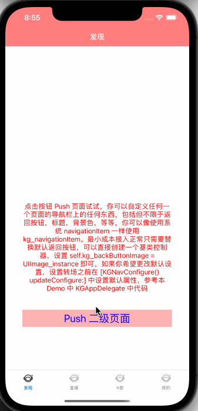

# KGNavigationBar


## Example

An iOS view-controller navigation management. No inherit, using one line code to integrate.

---

一个 iOS 控制器导航管理库. 无需继承， 一行代码即可实现集成。

---


## Requirements

* ARC
* iOS 7.0+
* Xcode 9.0+

## Installation

KGNavigationBar is available through [CocoaPods](https://cocoapods.org). To install
it, simply add the following line to your Podfile:

```ruby
pod 'KGNavigationBar'
```

## Features

- [x] 支持 UITabBar 有无场景
- [x] 支持缩放和系统平移效果
- [x] 支持全屏 Pop 返回
- [x] 全屏 Pop 返回支持自定义响应宽度
- [x] 支持单个页面禁用、开启全屏/边缘滑动 Pop
- [x] 支持导航栏一对一管理
- [x] 无需继承 UINavigationController 或者 UIViewController
- [x] 支持 UITabBarController 嵌套
- [x] 支持交互式手势 Push 页面
- [x] 支持便捷设置状态栏样式
- [x] 支持 UITabBar 高度变化
- [x] 适配刘海屏
- [x] 像使用系统 navigationItem 一样使用 kg_navigationItem
- [x] 支持页面以 Present 样式进栈出栈

## Getting Started

<details><summary>示例接入代码</summary>

```ObjC
#import <KGNavigationBar/KGNavigationBar.h>

- (BOOL)application:(UIApplication *)application didFinishLaunchingWithOptions:(NSDictionary *)launchOptions {
    
    // 非必要
    [KGNavConfigure() updateConfigure:^(KGNavigationBarConfigure *_Nonnull configure) {
        UIImage *image = [UIImage imageNamed:@"icon_back_black"];
        configure.backButtonImage = image;
        configure.backgroundColor = [[UIColor redColor] colorWithAlphaComponent:0.5];
        configure.titleColor = [UIColor whiteColor];
        configure.titleFont = [UIFont systemFontOfSize:17 weight:UIFontWeightBold];
    }];

    self.window = [[UIWindow alloc] initWithFrame:[UIScreen mainScreen].bounds];

    KGViewController *vc = [[KGViewController alloc] init];
    UINavigationController *navc = [KGNavigationController rootVC:vc transitionRatio:0.92];

    self.window.rootViewController = navc;
    [self.window makeKeyAndVisible];
    return YES;
}
```
</details>

> KGViewController 以及 KGNavigationController 根据实际情况替换


<details><summary>修改导航栏样式</summary>

```ObjC
self.kg_statusBarStyle = UIStatusBarStyleDefault;

self.kg_navigationBar.hidden = true;
self.kg_navLineHidden = true;
self.kg_navTitleColor = [UIColor blackColor];
self.kg_navigationItem.leftBarButtonItem = leftBarBtnItem;
self.kg_navigationItem.title = @"标题";
self.kg_navBackgroundColor = [UIColor blueColor];
self.kg_interactivePopDisabled = true;
self.kg_fullScreenPopDisabled = true;
```

</details>

> 具体使用请查看项目 Example


## Effect





## Star History

<p align="center">
  <a href="https://star-history.com/#wangwanjie/KGNavigationBar&Date">
    
  </a>
</p>


## Author

wangwanjie, vanjay.dev@gmail.com

## License

KGNavigationBar is available under the MIT license. See the LICENSE file for more info.
